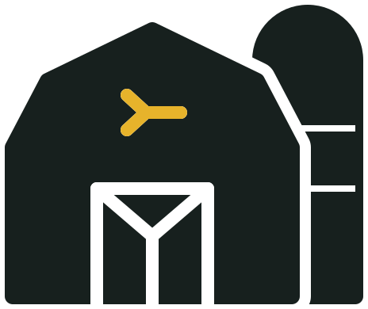

<p align="center">
  <picture>
    <source media="(prefers-color-scheme: dark)" srcset="assets/brand/yard-barn-dark.svg" />
    
  </picture>
</p>

<h1 align="center"><code>yard</code></h1>

<p align="center"><code>&gt;- a control plane for your herd</code></p>

<p align="center">
  
  
  
</p>

<h3 align="center">See the work. Direct the workers.</h3>

Yard turns terminal-based AI agents into a **spatial control plane for real
work**. Projects become places, workers stay visible, and orchestration,
knowledge, and automation have a concrete home on the map.

> **Yard 0.1 is an early preview.** The foundation is usable today, but the
> interface and operating model are still taking shape.

Yard is deliberately inspired by real-time strategy games. We are building
toward the feeling of surveying a living field of work: projects grow into
distinct places, workers move where attention is needed, child agents form
visible trees, and communication paths show coordination as it happens. The
RTS metaphor is an interaction model, not decoration; movement, activity, and
progress should always correspond to real runtime or durable state.

It sits above [Herdr](https://github.com/herdrdev/herdr), preserving the
terminal when you need it while adding the operational layer that terminal
tabs do not provide:

- **One map for active work** - see durable projects plus the selected Herdr
  session's workers, assignments, child agents, and communication state.
- **Move work, not just windows** - allocate or hand off workers, reuse
  operating profiles, send group orders, and resume retained Yard identities.
- **Orchestration at every level** - give each project an orchestrator, group
  projects under workstreams, and coordinate the whole portfolio through a
  dedicated superintendent.
- **Chat or terminal, without losing context** - switch between structured
  agent chat, an embedded terminal, and an external Ghostty window.
- **Knowledge and routines live on the map** - attach revisioned knowledge
  stores and scheduled automations to the orchestrator that owns their scope.
- **Evidence stays distinct from activity** - a running process, delivered
  prompt, or successful automation does not silently become "completed work."

| Component | v0.1 preview status |
|---|---|
| Interface | local browser app; light and dark themes |
| Runtime | Herdr protocols 19 through 22 |
| Persistence | local SQLite database and managed files |
| Distribution | source-built single executable; no published or signed release |

## Contents

- [The core idea](#the-core-idea-the-terminal-is-not-the-control-plane)
- [How Yard works](#how-yard-works)
- [Quick start](#quick-start)
- [First run](#first-run)
- [Projects and workers](#projects-and-workers)
- [Orchestration](#orchestration)
- [Knowledge and automations](#knowledge-and-automations)
- [Storage preview](#storage-preview)
- [Slack notifications](#slack-notifications)
- [Architecture](#architecture)
- [Configuration](#configuration)
- [Development and verification](#development-and-verification)
- [Current limits](#current-limits)

## The core idea: the terminal is not the control plane

Agent runtimes are good at running agents. Once several projects and sessions
are active, however, terminal topology stops answering the important
questions:

- Which worker owns which objective?
- What is active, blocked, or waiting for manual intervention?
- Which child agents belong to which parent?
- What context should move when work is handed off?
- Which orchestrator can coordinate across project boundaries?
- What evidence actually proves the work is done?

Yard makes those relationships durable and operable without replacing the
runtime underneath them.

```text
                         Superintendent
                               |
                  +------------+------------+
                  |                         |
          Project orchestrator      Workstream orchestrator
                  |                         |
           workers + children       projects + knowledge
                  |                         |
             Herdr sessions              automations
```

Herdr remains authoritative for live processes, panes, and terminals. Yard
owns project identity, assignments, orchestration, routing, artifacts,
knowledge snapshots, automation schedules, and completion evidence.

## How Yard works

```text
     Herdr sessions and terminals
                  |
                  v
      discovery + reconciliation
                  |
                  v
    Yard's durable operational model
                  |
        +---------+---------+
        |                   |
        v                   v
  spatial map       chat / terminal views
        |                   |
        +---------+---------+
                  |
                  v
       explicit commands to Herdr
```

Yard continuously observes Herdr and reconciles live runtime resources with
its durable model. Commands such as project creation, allocation, prompting,
handoff, and session termination are explicit, versioned operations. If Yard
cannot determine whether a runtime command landed, it records an ambiguous
outcome instead of guessing or retrying destructive work.

## Quick start

Source-install prerequisites:

- Git and a native C build toolchain;
- Rust 1.85 or newer;
- Node.js `^20.19.0` or `>=22.12.0` and npm.

Runtime prerequisites:

- Herdr exposing protocol 19 through 22, available as `herdr`;
- an authenticated agent provider supported by Herdr, such as Codex or Claude;
- a running Herdr session containing the agents you want to operate.

Install Herdr first if needed:

```sh
curl -fsSL https://herdr.dev/install.sh | sh
herdr --version
```

Then build and install Yard without `sudo`:

```sh
git clone https://github.com/arvmaan/yard.git
cd yard
./scripts/install.sh
export PATH="$HOME/.local/bin:$PATH"
yard start
```

The installer runs the locked frontend and Rust builds, then atomically
installs `yard` to `~/.local/bin`. Pass another bin directory as its first
argument or set `YARD_INSTALL_DIR` to change the destination. Relative
destinations are resolved from the directory where the installer was invoked.
Add that directory to `PATH` in your shell profile if needed.

`yard start` starts one managed background instance and opens its UI. The
other lifecycle commands are:

```sh
yard start --no-open  # start without launching a browser
yard status           # print mode, URL, PID, and log destination
yard stop             # gracefully stop only a managed instance
yard run              # foreground mode for logs, development, or containers
```

`yard status` exits `0` for a running or stopping instance and exits `1` after
printing `Yard is not running`. Repeated `start` and `stop` commands are safe.
A browser-launch failure prints a warning and URL but leaves Yard running.
Invalid CLI or configuration input exits `2`. Starting with a different
nonzero `YARD_BIND` while the same database is already running reuses the
verified owner and warns that the active address won. Bare `yard` prints help;
foreground operation is intentionally explicit.

The UI defaults to <http://127.0.0.1:4317/>. The React app, REST API, and
terminal WebSockets use that one loopback origin and one Yard process. The
installed executable embeds the production app and can run outside the source
tree; Node.js, npm, Vite, `node_modules`, and `web/` are build-time only.

Each database gets a private lifecycle directory below
`$YARD_RUNTIME_DIR`, `$XDG_RUNTIME_DIR/yard`, or a UID-qualified temporary
directory. The directory name is derived from the normalized database path.
Existing symbolic-link aliases resolve to the same database and lifecycle
owner. Hard-linked database files are rejected because SQLite cannot safely
coordinate separate lock paths for them.
It contains retained `yard.log`, persistent `launch.lock` and `instance.lock`
files, and the live instance's `instance.json` and `control.sock`. Directories
are mode `0700`; files and the socket are mode `0600`. The managed log is reset
for each launch, and tracing output retains at most 8 MiB.

The instance lock is held for the process lifetime. `status` and `stop`
authenticate the same-UID process through the private Unix socket using a
random per-launch secret. The stored PID is for display only and never drives
a signal. `yard run` publishes foreground ownership through the same channel;
`yard stop` refuses it and tells the operator to stop it in the owning
terminal.

Yard will display the sessions reported by Herdr. If there are none, start one
with Herdr before continuing.

## First run

1. Select a Herdr session from the top bar. Its observed workers appear on the
   map.
2. Create a reusable worker profile for new orchestrators. An observed
   workspace can instead be adopted with one of its existing workers.
3. Create a project and give it a working directory and objective. New
   projects receive a dedicated project orchestrator.
4. Drag unassigned workers into the project, or select several workers and send
   a group order.
5. Open a worker in **Chat** for structured messages or **Terminal** for the
   full session. Use **Open in Ghostty** when an external terminal is preferable.
6. Start the **Superintendent** to collect structured project updates and route
   work across project orchestrators.
7. Right-click empty map space to add a workstream orchestrator or knowledge
   store. Automations are attached to the orchestrator whose scope they serve.
8. When work is finished, select the worker and choose **Complete**. Yard waits
   five seconds (with **Undo**) before it records a minimal receipt: who
   completed it, when, and the objective, with no artifacts or evidence. Use
   **Complete with details…** for an evidence-backed receipt. Runtime state
   alone is never treated as proof.

## Projects and workers

Projects are persistent territories on a free-form map. Their boundaries,
placement, color, orchestrator, assignments, and relationships survive runtime
restarts. Archive and delete each take one confirmation, which first reads
`GET /api/v1/projects/{id}/disposition-preview`. When the project still has
active workers, the confirmation lists each one and reads **Archive and end N
active workers** (or **Delete and end N active workers**): their assignments
are recorded as cancelled with reason `project_archived`, never completed, and
their sessions end, while the agents keep running until their Herdr tabs are
closed. The request lists exactly the previewed assignments
(`active_work: "cancel"`, `expected_active_assignments`); if the set changed,
Yard answers 409 `project_archive_preview_stale` with a fresh preview and the
dialog asks again. A request without `active_work` is still refused with 409
`project_has_active_work`. Yard also refuses archive and delete while the
project has unresolved allocations, in-flight orchestrator prompts, routes,
replacements, or handoffs, or automations that scope or select it or have a
pending run (a selection held by an archived workstream's automation does not
count). Archive and delete accept only loopback `Host` and `Origin` headers,
like the other lifecycle commands. Runtime cleanup, transcript capture, and
knowledge snapshot collection continue in the background.

Archive can be undone; delete cannot. For 10 seconds after an archive the
map offers **Undo**, and the **Archived** shelf lists archived projects with
**Restore** while each is restorable (`GET /api/v1/archived`). Restore
(`POST /api/v1/projects/{id}/restore` with `expected_archive_command_id`)
re-binds the workspace and resumes the orchestrator: if its Herdr tab is still
the same pane it is bound again, otherwise the orchestrator comes back without
a runtime, as after a crash. Assignments the archive cancelled stay cancelled.
Restore refuses with 409 `project_restore_unavailable` and a `reason` when
Herdr is unreachable (retry later), another project or pending job holds the
workspace, the archive changed, or the project was deleted.

Workers can be:

- discovered from existing Herdr sessions;
- created from a reusable profile;
- assigned or handed off by dragging them between projects;
- prompted individually or as a selected group;
- resumed under the same Yard identity, with a replacement runtime when needed;
- opened in Ghostty using the exact bound terminal;
- ended explicitly when their session is no longer needed.

Completion and cancellation are recorded differently. **Complete** writes a
completion receipt marked `minimal`; the detailed form writes one marked
`detailed`, which still needs at least one artifact or evidence reference.
**End without completion** records the assignment as `cancelled` with a reason
and never writes a receipt. With **Complete and end session** on (the default,
stored in this browser), Complete also ends Yard's session for the worker and
queues runtime cleanup. Yard never closes the Herdr tab, so the agent keeps
running until you close its tab. Ending or deleting a worker that still has
active work asks once how the work ended (**Complete and end session** or
**Complete and delete**, **End without completion**, or **Cancel**).

When an assignment ends, Yard reads the worker's terminal once and keeps up to
10,000 recent lines (1 MiB) as a read-only transcript in the inspector. The
read is guarded by the runtime identity before and after, so a reused pane is
never recorded. If Herdr is unreachable the capture retries in the background;
if no text can be kept, the inspector shows **Transcript unavailable** and names
the provider session. Transcripts are stored as captured, without redaction.
The disposition request accepts only a loopback `Host` and, from a browser, a
loopback `Origin`; this is provenance, not authentication.

Live Codex and Claude subagents are shown as children connected to their parent
terminal. Exited subagents are removed from the active tree.

## Orchestration

Every project has exactly one project orchestrator. Yard can also provision:

- a **Superintendent**, the dedicated top-level Herdr session for portfolio
  status and cross-project routing;
- **workstream orchestrators**, which coordinate selected groups of projects;
- structured project updates that separate the last action, remaining work,
  current state, and required owner action.

A workstream can be archived or deleted from its inspector with one
confirmation that lists what changes. Archive hides it from the map, ends its
dedicated worker (Yard does not close the worker's Herdr tab; runtime cleanup
finishes after you close it), and pauses its automations, which leave the map
with it (Yard keeps them, paused, for audit; they cannot be resumed or run while
the workstream is archived). Delete also removes
it and its dedicated worker from Yard views, archiving it first if needed.
Neither changes attached projects, and both wait only for in-flight workstream
prompts and routes. Knowledge stores cannot be archived yet.

Connection paths reflect observed communication state: idle links remain
neutral, active exchanges turn green, and failed exchanges turn red. The
visual state follows persisted routing attempts; it is not decorative activity.

## Knowledge and automations

A knowledge store is a map node attached to one or more projects. Its
orchestrator asks those projects for standardized context, stores immutable
source snapshots, and records the combined revision without overwriting the
inputs. A project snapshot still uncollected 24 hours after its prompt is shown
as expired; files that arrive later still collect it.

Automations are recurring prompts attached to an orchestration scope:

- the superintendent for portfolio routines;
- a project orchestrator for project-specific work;
- a workstream orchestrator for a selected group of projects.

Schedules are daily and timezone-aware in v0.1. Every run has a durable record,
and successful delivery means only that the prompt reached its target.

## Storage preview

Yard can report reclaimable build output under the directories named in
`YARD_STORAGE_ROOTS`. This is a preview: **Yard deletes nothing yet**, and no
API accepts a filesystem path. When the variable is unset, nothing is scanned
and the API answers `not_configured`.

- `POST /api/v1/storage/scans` starts the single scan, or joins it while it is
  running, and answers `202 Accepted` with a `Location`. The request has no body.
- `GET /api/v1/storage/scans/{id}` returns the scan: its status, truncation,
  totals by safety, and candidates largest first. Each candidate has a
  server-issued ID, canonical path, class, allocated bytes (a hard-linked file counts
  once, and only when all of its links are inside the candidate; otherwise it
  is reported separately as shared), newest modification time, owner, and a
  `safe`, `review`, or `blocked` state with reasons. Only the last scan is kept,
  in memory, for 15 minutes.

Candidates need an exact directory name and a sibling marker: Rust `target/`
(`Cargo.toml`), `node_modules/` (`package.json`, always review), Vite `dist/`
(`vite.config.*`), Gradle `build/` and `.gradle/` (`build.gradle[.kts]` or
`settings.gradle[.kts]`), and a marked workspace's
`build/`, `env/`, `.build/`, and `.build-logs/` (a file named in
`YARD_STORAGE_WORKSPACE_MARKERS` next to a `src/` directory; with no marker
configured these workspace classes are off).
Generated output inside a Git work tree is `safe` only when it holds no tracked
files and Git ignores it. Nothing inside a workspace `src/` is ever a candidate; any
uncommitted, untracked, unpushed, or stashed work in a nested package repository
moves the workspace's `build/` and `env/` to review. Registered linked Git
worktrees are `safe` only when Yard recorded the checkout and it is unlocked,
clean (including untracked and ignored user files, skip-worktree or
assume-unchanged entries, and nested repositories or submodules), pushed, and
merged into the remote default branch (a configured root is never itself a
candidate); otherwise they are blocked with a reason such as
`Blocked: uncommitted changes`. Anything in use by a live Herdr pane or (on
Linux) a process is blocked, and every candidate is blocked when that check
cannot run (for example on macOS, which has no `/proc`). Unrecognized
`.worktrees/*` entries are reported as `unknown` and are never cleanable.

The scan never follows symlinks, never crosses into another file system, skips
Yard's own data, runtime, and executable paths, and runs one at a time under
entry and time budgets. It finds every candidate before sizing any, so when a
budget runs out the unsized candidates are still listed (truncated, never better
than `review`) and any directory that was never searched is named in `notes`.
Stopping Yard cancels a running walk. Git
runs read-only with no fetch. Both requests accept only a loopback `Host` and,
from a browser, a loopback `Origin`; this is provenance, not authentication.

## Slack notifications

Yard can DM one person (its owner) on Slack when something needs them, and,
when inbound is also on, let that person answer from the DM. It is off unless
`YARD_SLACK_NOTIFICATIONS=on`.

- **Outbound** (phase 1): DM notifications with a bot token (`chat:write`,
  `im:write`). On its own nothing in Slack can drive Yard.
- **Inbound** (phase 2, [Answering from Slack](#answering-from-slack)): off
  unless `YARD_SLACK_INBOUND=on` and `YARD_SLACK_APP_SECRET_ID` are also set.
  Yard opens an outbound Socket Mode WebSocket with an app-level token; there
  is still no inbound HTTP endpoint. Only the owner's own DMs and button clicks
  are accepted.

What is sent, derived on the server from durable state (not from the browser):

- **Blocked**: Herdr reports a bound worker, project orchestrator,
  superintendent, or workstream agent is waiting on a prompt in its terminal.
- **Ready for review**: an assignment worker went from working (or blocked) to
  Herdr's `done`. The message says no receipt has been recorded; Yard never
  infers completion. Turns started by Yard's automatic worker summary requests
  (the "auto-request worker summaries" setting) are not announced.
- **Command failed or ambiguous**: a prompt, route, allocation, handoff, or
  disposition ended `failed` or `ambiguous` ("Yard can't tell whether this
  landed; it was not retried").

Nothing is sent for ended, archived, or deleted work, for states that were
already true when Yard started, or while the agent's terminal or chat is open
in a browser tab (an open terminal counts while its socket is connected; an
open chat reports itself every 20 s while the tab is visible and counts for
60 s after each report; background status polling never counts). An
announcement that was skipped because the agent was open is not sent later. A state must hold through a settle window (15 s blocked, 20 s
ready for review, 10 s commands) and is announced once until it changes. At most
one message goes out every 10 seconds; anything that becomes ready meanwhile is
combined into one message (in the project's thread, or one digest when several
projects are involved), and a backlog older than an hour is summarized as a
count. Each project gets one DM thread; replies are broadcast so they notify.
Messages carry titles and states only (project, agent profile, a short
objective title, state, time), never terminal output, transcripts, file
contents, or links to this machine. The objective title is the first line of
the assignment objective, which is also the start of the worker's prompt, cut
to 80 characters; keep secrets and private detail out of that first line.
Every title passes a redactor that replaces credential-like words, loopback
URLs and local file paths.

The token lives in AWS Secrets Manager. Yard reads it with
`aws secretsmanager get-secret-value` (AWS CLI v2 on `PATH`), keeps it only in
memory, and never logs it, stores it, or returns it from an API. If Slack
rejects the token, Yard drops it and re-reads the secret after a backoff, so a
rotated secret is picked up without a restart. A missing or invalid setting
never stops Yard: Settings shows `misconfigured` with the reason. A setting
problem needs a restart; a problem found at runtime (the secret does not hold a
bot token, a different enterprise, a Slack error such as `channel_not_found`)
does not: fix it and press **Send test message** to retry at once, otherwise
Yard retries after its backoff (failed posts wait 30 s, doubling to 10 min).

`GET /api/v1/integrations/slack` reports
`{enabled, status: off|misconfigured|connecting|connected|error, team,
last_error, last_sent_at, restart_required}` (`last_sent_at` in Unix
milliseconds; `connecting` until the first connection attempt finishes). `POST
/api/v1/integrations/slack/test` sends one test DM; like lifecycle commands it
accepts only a loopback `Host` and, from a browser, a loopback `Origin`.
`PUT /api/v1/integrations/slack/presence` is the open chat's report; it has the
same guard and also requires `Sec-Fetch-Site: same-origin`, so only the Yard
page itself can mark an agent as open. The Settings dialog shows the status
and a **Send test message** button. With inbound configured, the status also
carries `inbound: {status: off|misconfigured|connecting|connected|error,
last_error}` (not shown in the web UI yet).

### Answering from Slack

With inbound on, the owner can use the DM with the Yard bot:

- **Unblock an agent.** A blocked notification is followed, in the same
  thread, by a card showing what the agent is asking, read from its terminal
  now: the question and its options, or the exact command of a permission or
  approval prompt (redacted: environment values, secret-looking flags, URL
  credentials, tokens and paths are replaced; capped at 1,500 characters).
  Each option has a button; permission prompts, and any menu that reads like
  one, get only **Allow once** and **Deny**. "Always allow", "don't ask
  again", "this session" and similar standing grants are never offered and
  can never be sent. A permission whose command is not fully shown (cut by
  the detail limit, the top of the screen or the 1,500-character cap) gets
  no buttons. A plain question from the agent gets its own top-level card
  with "reply in this thread"; the reply is delivered as a prompt prefixed
  `From Slack (owner):`. Herdr reports an agent that asks at its input box
  as finished rather than blocked, so a "finished" notification is followed
  by such a question card too when the agent's screen ends in a question.
  Only a question card's thread takes a free-text reply: typed text in any
  other thread (a menu or permission card, a notification, an answer) is
  not sent anywhere unless it starts with `<Project>:`; use the buttons, or
  open Yard for a menu's "Type something" entry. A prompt Yard cannot parse
  confidently gets a
  redacted screen excerpt and "open Yard", never guessed buttons; so do
  multi-select (checkbox) lists and Submit / Review steps. An agent that is
  no longer blocked gets a note and nothing from its screen. About 1.5 s
  after a button is sent Yard reads the pane again: a next prompt (for
  example question 2 of a multi-question dialog) gets its own card in the
  same thread, and a prompt that is still unchanged gets "open Yard". A
  refused or expired button collapses its card to "not sent — reason".
- **Status commands** (instant, from durable state, no model involved):
  `status` (every project, the Superintendent and workstreams), `status
  <project>` (one project's agents), `blocked` (a card with answer buttons for
  each blocked agent, at most 5), `review` (workers whose turn finished) and
  `help`. They show titles and states only. A message Slack delivers more
  than 5 minutes late (Yard offline or reconnecting) is not acted on; Yard
  replies once in its thread asking to send it again.
- **Questions.** Any other top-level message goes to the Superintendent, or to a
  project's orchestrator when it starts with the project's name and a colon
  (`Telemetry: what's left?`). It is delivered through the same guarded
  orchestrator prompt path as Yard's prompt box, prefixed `From Slack
  (owner):`, and refused while that orchestrator is itself waiting on a prompt
  (its card is shown instead). The orchestrator answers with Yard's status
  report for that prompt; Yard re-reads the pane every 5 s and posts the
  report whose command ID matches (state, `last`, `next`, blockers; redacted,
  capped at 2,900 characters with "(truncated)") in the thread. Nothing else
  from the terminal is relayed; a report the agent's UI wrapped over several
  rows (up to 60) is rejoined. With no report after 5 minutes Yard says so
  and keeps watching, every 30 s, for up to 30 minutes; at most 4 answers are
  watched at once.

Every button carries only a random single-use ID that expires after 5 minutes;
Yard keeps the rest (agent, terminal identity, a fingerprint of the prompt as
shown, the option) in memory, so a restart invalidates open buttons. Before
typing anything Yard re-reads the pane and requires the same terminal (worker,
terminal, pane, tab, provider session), the agent still blocked, and the same
prompt fingerprint; with the terminal lease held it reads the pane again
(same prompt and cursor) and checks the cursor is on the option before Enter;
otherwise nothing is typed and the current prompt is shown.
Keys go through the terminal lease the web terminal uses, so an agent whose
terminal you control in Yard is answered there ("open in Yard"). An event is
accepted only from the configured owner, in the bot's DM, from the same team,
enterprise and app, not from a bot, not edited, not a retry of one already
handled, and less than 5 minutes old; everything is acknowledged to Slack
within its 3-second window before any work. Each inbound action and its
outcome is appended to `slack-audit.jsonl` beside the database (0600; Slack
user, action, target, outcome; never message or prompt text); dropped events
(anyone but the owner, stale, malformed) go to `slack-audit-dropped.jsonl`,
so they can never rotate the owner's records away. Run inbound on
one Yard only: Slack spreads events over every open connection.

### Setting it up

Build and test in a sandbox workspace first; production later uses the same
manifest.

1. In Slack, create a personal sandbox workspace on
   `example-sandbox.enterprise.slack.com`.
2. Create an app **From a manifest** (JSON) with
   [`docs/slack/manifest.json`](docs/slack/manifest.json), or
   [`docs/slack/manifest-outbound-only.json`](docs/slack/manifest-outbound-only.json)
   if you want notifications only (rename it `Yard-<name>` first), then
   **Install to Workspace**.
3. Copy the **Bot User OAuth Token** (`xoxb-…`) from **OAuth & Permissions**.
4. Store it yourself; Yard only reads it:

   ```sh
   umask 077
   read -rs 'token?Bot token: '    # bash: read -rsp 'Bot token: ' token
   printf '{"bot_token":"%s"}' "$token" > bot-token.json
   unset token
   aws secretsmanager create-secret --profile yard-dev --region us-west-2 \
     --name yard/slack-bot --secret-string file://bot-token.json
   rm -P bot-token.json            # Linux: shred -u bot-token.json
   ```

   This keeps the token out of the process list and your shell history (never
   put it on the command line: Yard's own agents run as you and can read
   history). Rotate the same way with `aws secretsmanager put-secret-value
   --secret-id yard/slack-bot --secret-string file://bot-token.json` (every 90
   days or per your workspace policy). A plain `xoxb-…` secret string also works.
5. Find your member ID: your Slack profile, **⋮**, **Copy member ID**
   (`U…`). Member IDs differ between the sandbox and production workspaces.
6. Set the variables on the command that starts Yard and restart it:

   ```sh
   YARD_SLACK_NOTIFICATIONS=on \
   YARD_SLACK_SECRET_ID=yard/slack-bot \
   YARD_SLACK_AWS_PROFILE=yard-dev \
   YARD_SLACK_OWNER_USER_ID=U0123ABCD \
   YARD_SLACK_ENTERPRISE_ID=E01SANDBOX0 \
   yard start
   ```

   `YARD_SLACK_ENTERPRISE_ID` is optional; when set, Yard refuses to send if
   `auth.test` reports a different enterprise. Start without it, read the
   enterprise ID that `GET /api/v1/integrations/slack` reports under `team`
   once connected, then pin it (the value above is a placeholder). Enable
   Slack only on the one Yard instance you watch; a rehearsal instance with
   the same settings would DM you too.
7. Open **Settings**, check the Slack row says connected, and press **Send test
   message**.

To turn on inbound (an app created from the outbound-only manifest, or before
phase 2, needs steps 8–9 first):

8. In the app's settings, open **App Manifest**, paste
   [`docs/slack/manifest.json`](docs/slack/manifest.json), save, and
   **Reinstall to Workspace** (it adds `im:history`, the `message.im` event,
   interactivity, the Messages tab and Socket Mode). The bot token usually stays
   the same; if Slack issues a new one, store it as in step 4 with
   `put-secret-value`.
9. Under **Basic Information → App-Level Tokens**, **Generate Token and
   Scopes** with the one scope `connections:write`, and store the `xapp-…`
   token under its own secret the same way:

   ```sh
   umask 077
   read -rs 'token?App-level token: '    # bash: read -rsp 'App-level token: ' token
   printf '{"app_token":"%s"}' "$token" > app-token.json
   unset token
   aws secretsmanager create-secret --profile yard-dev --region us-west-2 \
     --name yard/slack-app --secret-string file://app-token.json
   rm -P app-token.json            # Linux: shred -u app-token.json
   ```

10. Add `YARD_SLACK_INBOUND=on YARD_SLACK_APP_SECRET_ID=yard/slack-app` to the
    variables of step 6 and restart Yard. `GET /api/v1/integrations/slack`
    reports `inbound.status: connected`; DM the bot `help`. The app-level token
    is read, held and redacted like the bot token; a rejected one is dropped
    and re-read. Without `YARD_SLACK_APP_SECRET_ID`, or if the app secret
    cannot be read, inbound reports `misconfigured` or `error` and
    notifications keep working.

For an isolated rehearsal, a debug build (`cargo build`, never `--release`)
honours `YARD_SLACK_TEST_ENDPOINT=http://127.0.0.1:<port>`: the Web API and
the Socket Mode URL then go to a fake Slack on that loopback port (any other
value is ignored with a warning, and a WARN is logged while it is active).
Release builds do not read it.

For production: recreate the app from the same manifest in your production
workspace and follow that workspace's app-approval process. The bot scopes are
`chat:write`, `im:write`, and (inbound only) `im:history`; `connections:write`
belongs to the app-level token, not the bot. The app stores no Slack
conversation data (the audit file keeps who did what, never message text) and
sends nothing to a third party. Then store the production tokens under their
own secrets, and update `YARD_SLACK_SECRET_ID`, `YARD_SLACK_APP_SECRET_ID`,
`YARD_SLACK_OWNER_USER_ID`, and `YARD_SLACK_ENTERPRISE_ID`.

## Architecture

Yard is a Rust workspace with a React client embedded in the `yard`
executable:

```text
crates/
  yard-domain/    provider-neutral commands and durable entities
  yard-herdr/     Herdr discovery, lifecycle, output, and terminal adapter
  yard-store/     SQLite persistence and migrations
  yard-server/    embedded UI plus loopback REST and WebSocket control plane
web/
  src/            React source for the embedded UI and Vite development
  tests/          Playwright acceptance coverage
scripts/
  install.sh
  cli-lifecycle-smoke.sh
  embedded-binary-smoke.sh
  live-herdr-smoke.sh
  live-v1-acceptance.sh
```

The Cargo package and library remain internally named `yard-server` and
`yard_server`; the package's sole executable target is named `yard`.

The production web build is compiled into the Rust executable and served by
the same Axum router as the API. The server binds only to loopback while Yard
has no authentication layer. SQLite runs in WAL mode, and one Yard process
exclusively owns a database.

## Configuration

| Variable | Purpose | Default |
|---|---|---|
| `YARD_BIND` | UI and API socket; loopback addresses only | `127.0.0.1:4317` |
| `YARD_HERDR_BIN` | Herdr executable | `herdr` |
| `YARD_GHOSTTY_BIN` | Ghostty executable | macOS app bundle, then `ghostty` |
| `YARD_DATABASE_PATH` | SQLite control database | `$XDG_DATA_HOME/yard/yard.sqlite3` or `$HOME/.local/share/yard/yard.sqlite3` |
| `YARD_ARTIFACT_PATH` | managed artifact bytes | `artifacts/` beside the database |
| `YARD_COORDINATION_PATH` | managed workstream directories | `coordination/` beside the database |
| `YARD_KNOWLEDGE_PATH` | managed knowledge snapshots | `knowledge/` beside the database |
| `YARD_ORCHESTRATOR_CWD` | working directory for the superintendent | process working directory |
| `YARD_RUNTIME_DIR` | private base directory for database-scoped lifecycle state and logs | `$XDG_RUNTIME_DIR/yard` or UID-qualified temporary directory |
| `YARD_STORAGE_ROOTS` | colon-separated absolute directories the read-only storage preview may scan; each must be an existing directory and not itself a symlink, including spellings such as `link/` or `link/.` (symlinked ancestors are fine), for example `/local/home/sample/workspaces:/home/sample/yard`; an invalid or missing entry stops `yard start` with a configuration error (fail closed) | unset: nothing is scanned |
| `YARD_STORAGE_LOG_RETENTION_DAYS` | build logs newer than this many days keep a workspace candidate in review | `14` |
| `YARD_STORAGE_WORKSPACE_MARKERS` | comma-separated file names that mark a workspace root (a directory holding one of them and a `src/` directory), for example `workspace.toml`; its `build/`, `env/`, `.build/`, and `.build-logs/` become workspace candidates | unset: workspace classes disabled |
| `YARD_SLACK_NOTIFICATIONS` | `on` enables outbound Slack DM notifications ([Slack notifications](#slack-notifications)); any other value except `off` reports `misconfigured` | `off` |
| `YARD_SLACK_SECRET_ID` | Secrets Manager secret name or ARN holding `{"bot_token":"xoxb-…"}` or a plain `xoxb-…` string; required when on | unset |
| `YARD_SLACK_AWS_PROFILE` | AWS CLI profile used to read the secret | unset: default credential chain |
| `YARD_SLACK_AWS_REGION` | region of the secret | `us-west-2` |
| `YARD_SLACK_OWNER_USER_ID` | Slack member ID (`U…` or `W…`) of the one person Yard DMs; required when on | unset |
| `YARD_SLACK_ENTERPRISE_ID` | when set, Yard sends nothing unless `auth.test` reports this Slack enterprise (fail closed) | unset: not checked |
| `YARD_SLACK_INBOUND` | `on` (with notifications on) answers the owner's DMs and buttons over Socket Mode ([Answering from Slack](#answering-from-slack)); any other value except `off` reports inbound `misconfigured` and leaves notifications running | `off` |
| `YARD_SLACK_APP_SECRET_ID` | Secrets Manager secret name or ARN holding `{"app_token":"xapp-…"}` or a plain `xapp-…` string (app-level token with `connections:write`), read with the same profile and region; required when inbound is on | unset |
| `YARD_API_TARGET` | Vite development proxy target only | `http://127.0.0.1:4317` |

Stop Yard before copying its database and managed directories for backup.
Managed coordination and knowledge paths reject symlink traversal.

## Development and verification

### Embedded production build

The `yard-server` Cargo package's build script runs the local `npm run build`
with
`NODE_ENV=production` and writes the production assets under Cargo's `OUT_DIR`;
`include_dir` then embeds those bytes in the executable. Cargo reruns that step
after a clean target or when frontend source, public assets, package manifests,
or build configuration changes. Unrelated incremental Rust builds reuse
Cargo's result.

Cargo's build script never installs frontend dependencies; it only runs the
local build tools installed by an explicit `npm ci`, which creates
`node_modules` from `web/package-lock.json`. Cargo only checks that
`node_modules` exists, so rerun `npm ci` after cloning, changing the lockfile, or
switching from a branch with a different dependency tree. Missing Node.js, npm,
or `node_modules` fails the Rust build with the command needed to fix it. A
manual `npm run build` writes ignored `web/dist`; generated frontend output is
not committed and the Cargo build embeds its own `OUT_DIR` copy.

### Frontend development and HMR

For React work, keep the two-process Vite workflow. Start the API from the
repository root:

```sh
cargo run -p yard-server -- run
```

Then start Vite in another terminal:

```sh
cd web
npm run dev
```

Open <http://127.0.0.1:5173/> for HMR. Vite continues to proxy `/api` and
`/health` (including API WebSockets) to `YARD_API_TARGET`. Production assets,
API calls, and WebSockets use same-origin URLs and do not compile an API port
into the client.

### Verification

Install frontend dependencies and run the web gates first:

```sh
cd web
npm ci
npm run lint
npm run build
npm run test:unit
cd ..
```

Run the Rust gates from the repository root:

```sh
cargo fmt --all -- --check
cargo test --workspace --all-targets
cargo clippy --workspace --all-targets -- -D warnings
cargo build --release --locked -p yard-server --bin yard
bash scripts/embedded-binary-smoke.sh target/release/yard
bash scripts/cli-lifecycle-smoke.sh target/release/yard
bash -n scripts/install.sh
bash -n scripts/cli-lifecycle-smoke.sh
bash -n scripts/live-herdr-smoke.sh
bash -n scripts/live-v1-acceptance.sh
```

`scripts/embedded-binary-smoke.sh` copies the release executable to an
isolated temporary directory, launches it with no Node/npm tools on its runtime
`PATH`, and verifies health, UI, an embedded asset, SPA fallback, a real API
route, and unknown-API behavior.

`scripts/cli-lifecycle-smoke.sh` uses isolated HOME/XDG paths and ephemeral
IPv4/IPv6 ports. It covers managed and foreground ownership, status/stop
semantics, repeated and concurrent commands, permissions, SIGTERM, stale crash
recovery, browser suppression/failure, bind conflict, separate database roots,
and unrelated-PID safety.

`scripts/live-herdr-smoke.sh` creates real temporary Herdr resources. The
historical `live-v1-acceptance.sh` harness also launches authenticated Codex
workers with `--yolo`, can consume model quota, and defaults to a one-hour run.
Read both scripts before running them. Browser acceptance additionally requires
`npx playwright install chromium` followed by `npm run test:e2e` in `web/`.

See [CONTRIBUTING.md](CONTRIBUTING.md) for change and review expectations and
[SECURITY.md](SECURITY.md) for the local trust boundary.

## Current limits

Yard 0.1 is an early, single-user local tool:

- there is no authentication, authorization, TLS, or remote deployment model;
- Herdr protocols 19 through 22 are the only supported runtime adapter versions;
- there are no packaged or signed binaries;
- managed background lifecycle and automatic browser launch target Linux and
  macOS; Windows is not currently supported;
- interrupted project creation, allocation, or handoff can retain a safety
  reservation without a self-service cancel or resolve workflow;
- knowledge collection and automation delivery are transport events, not
  completion evidence;
- the storage scan is a preview: it reports reclaimable output but cleanup is
  not implemented yet.

See [CHANGELOG.md](CHANGELOG.md) for the v0.1 feature summary.

## License

[MIT](LICENSE)
